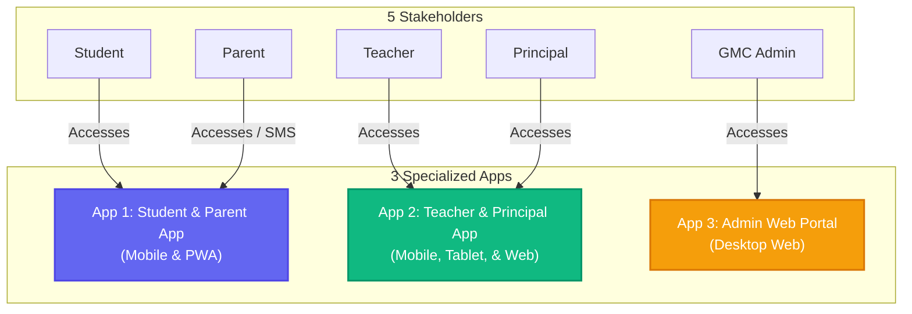

# GMC Education Portal — Three-App Architecture Proposal (Updated)

**Version:** 1.2  
**Date:** May 2026  
**Status:** Under Review  
**Prepared By:** Product & Architecture Team  

---

## Executive Summary

Based on your feedback, we have optimized the architectural framework of the **GMC Education Portal**. We are consolidating the workflow of our five stakeholders into exactly **three specialized digital platforms** using neutral naming:

1.  **Student & Parent App:** A single mobile app for the entire family.
2.  **Teacher & Principal App:** A combined app for school-level staff.
3.  **Admin Web Portal:** A dedicated web portal for central administrators.

---

## 1. App 1: Student & Parent App
*A unified, lightweight, offline-first mobile application designed for shared family devices.*

> [!NOTE]
> **Consolidation Rationale:** Many students share a single smartphone with their parents. Combining Student and Parent portals into one application with a secure profile-switcher keeps storage footprints minimal, prevents confusion, and eliminates double-installation friction.

### Key Technical Specs
*   **Target Devices:** Low-end Android smartphones (Android 6.0+, 1GB RAM) & progressive web app (PWA).
*   **Target Install Size:** `< 12 MB` (extremely optimized asset delivery).
*   **Primary Languages:** Gujarati (Default), Hindi, English.
*   **Connectivity:** Offline-first. 100% of downloaded materials and queued assignments work without internet.

### Core Features
*   **Offline Material Library (F-ST-001):** Browse and search downloaded PDF notes and textbooks.
*   **In-App File Viewer (F-ST-002):** Lightweight viewer supporting PDFs, PNGs, and JPEGs without third-party dependencies.
*   **Daily & Weekly Timetable (F-ST-005):** Visual layout of school periods and teacher schedules.
*   **Assignment Submission (F-ST-008):** Quick camera photo-capture of handwritten homework pages.
*   **Offline Queue Manager (F-ST-009):** Automatic background syncing of submissions once connectivity is detected.
*   **Secure Profile Switcher (F-PA-007):** Swipe-to-switch between the student's study desk and the parent's dashboard using a secure secondary PIN.
*   **Parent's Attendance Calendar (F-PA-005):** Simplified Gujarati color-coded calendar highlighting daily attendance.
*   **Parent's Academic Progress Card (F-PA-006):** At-a-glance reports of marks and teacher feedback.

---

## 2. App 2: Teacher & Principal App
*A unified, collaborative mobile and tablet application that connects school leadership and teaching staff.*

> [!IMPORTANT]
> **Consolidation Rationale:** Combining Teachers and Principals into one application dramatically improves communication and speeds up approval loops. Since both stakeholders operate at the school level and share the same physical environment, a single app with internal role switches enables teachers to teach and principals to oversee from their phones or school tablets.

### Key Technical Specs
*   **Target Devices:** Mid-end Android smartphones, school-allocated Android tablets, and responsive web browsers.
*   **Target Install Size:** `< 18 MB`.
*   **Primary Languages:** Gujarati, Hindi, English.
*   **Connectivity:** Offline attendance marking and grading with automatic sync.

### Teacher Mode Features
*   **One-Screen Attendance Register (F-TE-001):** Quick list to toggle student attendance in under 90 seconds (Present, Absent, Late, Excused).
*   **Class Material Uploader (F-TE-005):** Upload PDF study guides or board snapshots directly from the camera.
*   **Assignment Creator & Tracker (F-TE-008 / F-TE-009):** Form to create assignments and grade submissions.
*   **Offline SQL Sync Queue (F-TE-002):** Automatically saves attendance and marks locally, syncing when school Wi-Fi or cellular networks are active.

### Principal Mode Features
*   **School Dashboard (F-PR-001):** Real-time daily, weekly, and monthly attendance rates aggregated by grade level and section.
*   **Instant Approvals Queue (F-PR-004 / F-PR-005):** Direct approval interface where the Principal can review and sign off on a teacher's request to edit finalized marks or backdated attendance.
*   **Roster & Staff Directory (F-AD-003):** View lists of students, classes, and assign teaching schedules.
*   **Announcement Broadcaster (F-PR-009):** Publish notices that automatically trigger transactional SMS messages to parents.
*   **Report Generator (F-PR-006):** Generate compliant PDF reports for Gandhinagar Municipal Corporation submission.

---

## 3. App 3: Admin Web Portal
*A high-security, responsive desktop dashboard designed exclusively for macro-level administrative control.*

> [!WARNING]
> **Consolidation Rationale:** Central administrators at Gandhinagar Municipal Corporation require macro-level analytics, data auditing, and policy tools—never classroom details. Separating this into an exclusive desktop web portal keeps administrative databases isolated and secure under India's DPDP Act 2023.

### Key Technical Specs
*   **Target Devices:** Desktops and laptops (Chrome 90+, Edge 90+, Safari 14+).
*   **Target Install Size:** Web-only (Next.js/React server-rendered architecture).
*   **Primary Languages:** English and Gujarati.
*   **Connectivity:** Always-online. Requires robust broadband.

### Core Features
*   **District Attendance Heatmap (F-AD-006):** Geographic and tabular view of school-wise performance metrics across all 100+ GMC Gandhinagar schools.
*   **School Directory & Onboarding (F-AD-001):** Interface to register new government schools, assign principal accounts, and manage database servers.
*   **Bulk CSV Engine (F-AD-003):** Fast data processor to upload thousands of student profiles and academic schedules during academic transitions.
*   **District Announcement Broadcaster (F-AD-009):** Push administrative changes or emergency circulars to all schools and staff simultaneously.
*   **Compliance & Audit Log Viewer (F-AD-010):** Chronological log tracking logins, database mutations, role alterations, and API request IPs to meet DPDP Act regulatory mandates.

---

## Summary comparison of the 3-App Strategy

| Metric / Dimension | App 1: Student & Parent App | App 2: Teacher & Principal App | App 3: Admin Web Portal |
|---|---|---|---|
| **Primary Users** | Students & Parents | Teachers & Principals | GMC Central Administrators |
| **Primary Device** | Low-end Mobile (Android/PWA) | Mobile, Tablet, & Web | Desktop & Laptop Web Portal |
| **Connectivity Mode** | Offline-First (Local Sync) | Offline-First (Local Sync) | Always-Online |
| **Install Budget** | `< 12 MB` | `< 18 MB` | No Install (Web Portal) |
| **Primary Goal** | Equal learning & status transparency | Smooth teaching and school administration | District compliance & analytics |

---

## Next Steps

1.  **Stakeholder Signoff:** Validate this final three-app split with Gandhinagar Municipal Corporation stakeholders.
2.  **Schema Configuration:** Audit the database scripts in `/db` to ensure role-based permissions align perfectly with:
    *   *Student/Parent* API tokens (Read/Write to assignments, Read materials).
    *   *School Staff* (Teacher/Principal) API tokens (Write attendance, Write grades).
    *   *GMC Admin* API tokens (Write school directory, Read analytics).
